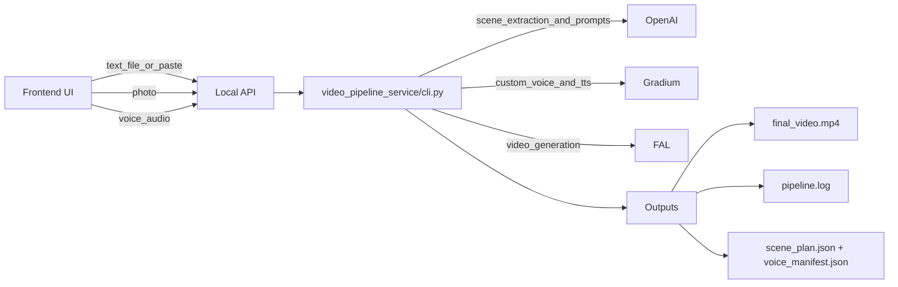

# Peng-vid

A video generation pipeline that brings your text to life WITH personalization. 

**Your voice, your image, your story - bring it all to life.**

The pipeline extracts chapters from text, generates voice narration with your voice, creates styled videos and then stitches everything together into a final video!

## How generation works (at a glance)

Inputs come from the frontend upload form (or CLI): **text** (directly pasted or `.txt/.md/.csv`), a **reference photo**, and a **voice recording**.

- **OpenAI**: extracts a scene plan from the text and writes per-scene visual prompts (style-aware).
- **Gradium**: creates/clones a custom voice from the recording and generates per-scene narration audio.
- **FAL**: generates per-scene video clips from the prompts using the reference prompt

The pipeline then muxes each scene’s audio+video and concatenates everything into a final MP4, along with intermediate manifests/logs under `pipeline_output/`.



## Prerequisites

- Python >= 3.12
- Node.js (for the frontend)
- [uv](https://docs.astral.sh/uv/) (recommended) or pip

## Environment Variables

Create a `.env` file in the project root with your API keys:

```
OPENAI_API_KEY=<your-openai-api-key>
GRADIUM_API_KEY=<your-gradium-api-key>
FAL_KEY=<your-fal-key>
```

## Setup

### Install Python dependencies

```bash
# Using uv (recommended)
uv sync

# Or using pip
pip install -e .
```

### Install frontend dependencies

```bash
cd frontend
npm install
```

## Running the Application

You need to run both the backend API server and the frontend dev server.

### 1. Start the backend

```bash
python -m uvicorn video_pipeline_service.api:app --host 0.0.0.0 --port 8000
```

### 2. Start the frontend (in a separate terminal)

```bash
cd frontend
npm run dev
```

The frontend will be available at `http://localhost:5173` and connects to the backend at `http://localhost:8000`.

## CLI Usage

You can also run the pipeline directly from the command line without the frontend.

### Extract scenes from text

```bash
scene-plan --input-file <text_file> --number-of-scenes 12 --output scene_plan.json --style miyazaki
```

### Generate voice narration

```bash
voice-gen --scene-plan scene_plan.json --voice-id <voice_id> --manifest voice_manifest.json
```

### Run the full video pipeline

```bash
video-pipeline --input-file <text_file> --voice-id <voice_id> --face-image <photo.jpg> --output-dir pipeline_output --style miyazaki
```

## Available Art Styles

Miyazaki, Superhero, Watercolor, Pixel Art, Noir, Cyberpunk, Disney, Manga, Oil Painting, Fantasy